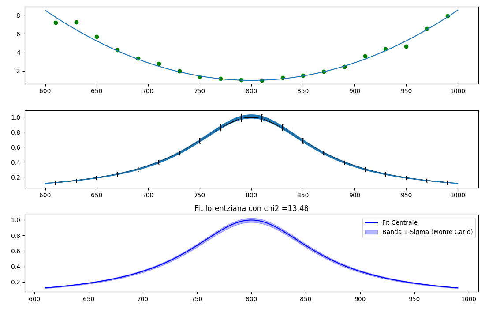
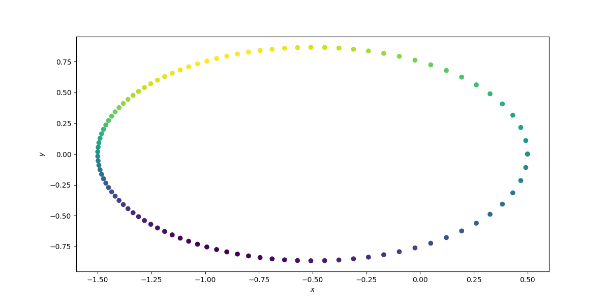
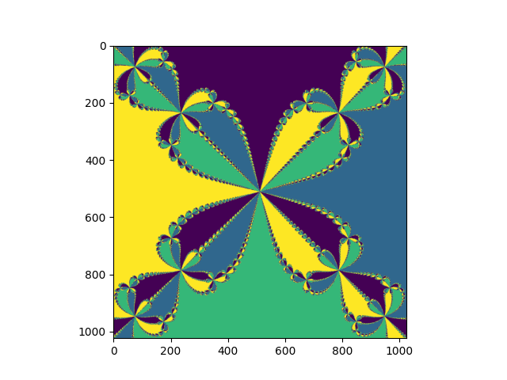

<p align="center">
  
  
  
  
  
</p>

<h1 align="center">⚛️ Computational Physics Laboratory</h1>
<h3 align="center">
Numerical Methods • Linear Algebra • Scientific Computing — UNIMIB 2025/2026
</h3>

<p align="center">
  <b>From first principles to real physics problems.</b><br>
  <i>Algorithms built, not just used.</i>
</p>

---

## 🚀 Highlights

* 🔬 **Algorithms built from scratch**
* 📊 **Real physics applications** (PDEs, quantum wells, orbital mechanics)
* 🧠 **Numerical stability & error analysis**
* 🎨 **Scientific visualization & fractals**
* ⚙️ Custom **linear algebra library**

---

## 📋 Table of Contents

* [🎯 Overview](#-overview)
* [📂 Repository Structure](#-repository-structure)
* [🧪 Lessons](#-lessons)
* [🧰 LINALG Library](#-linalg-library)
* [🖼 Gallery](#-gallery)
* [🛠 Installation](#-installation)
* [▶️ Usage](#️-usage)
* [👤 About](#-about)

---

## 🎯 Overview

This repository collects computational physics exercises developed during the **Computational Laboratory course** at UNIMIB.

Each algorithm is implemented **from scratch** to understand:

* mathematical structure
* numerical stability
* convergence behavior

From floating-point precision to quantum bound states, the project bridges **theory and computation**.

> **Core philosophy:** *Understand → Implement → Validate → Visualize*

---

## 📂 Repository Structure

```bash id="h0p2zn"
Computational-Lab/
├── lezione_1/
├── lezione_2/
├── lezione_3/
├── lezione_4/
├── lezione_5/
├── lezione_6/
├── lezione_7/
├── lezione_8/
├── lezione_9/
├── linalg/
└── assets/
    ├── lezione_6/
    │   └── fit_lorentzian.png
    ├── lezione_7/
    │   └── kepler_orbit.png
    └── lezione_8/
        └── newton_fractal.png
```

---

## 🧪 Lessons

| Lesson | Topic             | Key Insight                   |
| ------ | ----------------- | ----------------------------- |
| 1      | Floating-point    | Precision depends on ordering |
| 2      | LU + Poisson      | Factorization solves PDEs     |
| 3      | QR                | Orthogonality = stability     |
| 4      | Eigenvalues       | QR reveals spectra            |
| 5      | Interpolation     | Splines > polynomials         |
| 6      | Fitting           | Statistics matters            |
| 7      | Root finding      | Robust vs fast                |
| 8      | Newton & fractals | Chaos + convergence           |
| 9      | Hermite           | Roots = eigenvalues           |

---

## 🧰 LINALG Library

Custom educational linear algebra toolkit:

* LU decomposition (pivoting)
* QR decomposition (Gram-Schmidt)
* Eigenvalue solvers (QR, power iteration)
* Linear system solvers
* Norms & conditioning

> Designed to understand **O(n³)** complexity and numerical behavior.

---

## 🖼 Gallery

### 📊 Data Fitting (Lezione 6)

<p align="center">
  
</p>

<p align="center">
<i>Lorentzian fit with χ² analysis and Monte Carlo uncertainty band</i>
</p>

---

### 🪐 Orbital Mechanics (Lezione 7)

<p align="center">
  
</p>

<p align="center">
<i>Elliptical orbit from numerical solution of Kepler’s equation</i>
</p>

---

### 🌌 Fractals (Lezione 8)

<p align="center">
  
</p>

<p align="center">
<i>Newton fractal — basins of attraction in the complex plane</i>
</p>

---

## 🛠 Installation

```bash id="yzzph1"
git clone https://github.com/Livio2004/Computational-Lab.git
cd Computational-Lab

python -m venv venv
source venv/bin/activate  # Windows: venv\Scripts\activate

pip install numpy scipy matplotlib jupyter
```

---

## ▶️ Usage

```bash id="41ztv5"
cd lezione_8
jupyter notebook
```

Each notebook includes:

1. Theory
2. Implementation
3. Validation
4. Physics application
5. Visualization

---

## 👤 About

**Livio**
BSc Physics — University of Milano-Bicocca
Computational Physics Laboratory (2025/2026)

---

<p align="center">
<b>“Understand the math. Build the algorithm. Trust the result.”</b>
</p>

<p align="center">
⭐ If you like the project, consider starring the repo!
</p>

